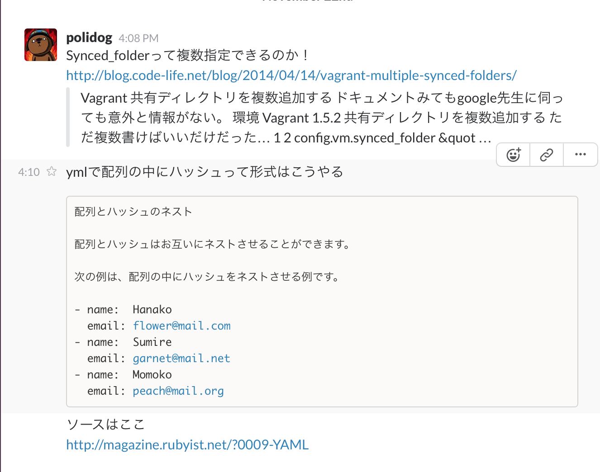
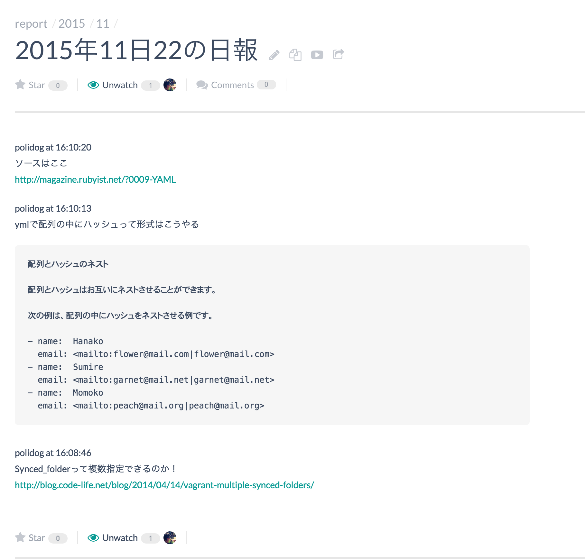
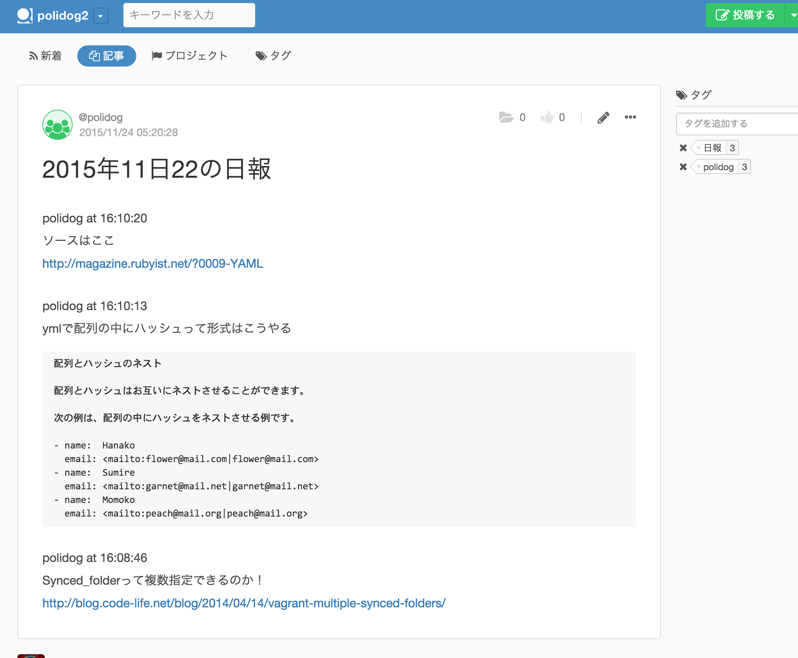

nippo
===

分報から日報を作り出すためのnpm。
1日分の分報を日報として出力します。

input(slack) → 加工 → output(qiita team or esa.io)に出力。
みたいなイメージです。


分報？って方はこちらの記事をよんでもらえるとわかるかと思います。  
[Slackで簡単に「日報」ならぬ「分報」をチームで実現する3ステップ 〜 Problemが10分で解決するチャットを作ろう](http://c16e.com/1511101558/)  


v0.2.0現在で対応しているサービスは以下のとおり。

- input
 - [slack](https://slack.com/)
- output
 - [esa.io](https://esa.io/)
 - [qiita team](https://teams.qiita.com/)


## 使い方

まずはインストールしましょう。

```
$ npm install nippo
```

あとはjsをちょこっと書くだけ


```
var nippo = require("nippo")

var config = {
  "output": {
    "service": "esa",
    "team": "your team name",
    "token": "your token",
    "category": "report/%year%/%month%"
  },
  "input": {
    "service": "slack",
    "token": "your token",
    "channel": "report"
  },
  "formatter": {
    "service": "default"
  }
};

nippo(config, 1); // 1を指定することで、1日前の日報を作成します。

// ちなみにこんな事もできます
nippo(config, 1).then(function(outputResponse){
  console.log(outputResponse);
});

```

### QiitaTeamで使ってみる。

```
var nippo = require("nippo")

var config = {
  "output": {
    "service": "qiitateam",
    "team": "hoge", // https://hoge.qiita.com
    "token": "your token",
    "category": "report/%year%/%month%"
  },
  "input": {
    "service": "slack",
    "token": "your token",
    "channel": "report"
  },
  "formatter": {
    "service": "default"
  }
};

nippo(config, 1); // 1を指定することで、1日前の日報を作成します。

// ちなみにこんな事もできます
nippo(config, 1).then(function(outputResponse){
  console.log(outputResponse);
});

```

## 日報に反映するときのフォーマットを変更する

esa.ioやqiita teamに投稿するドキュメントを加工することも可能です。

まずは適当なディレクトリにフォーマッターを用意します。

```
$ mkdir ./formatter
```

次にフォーマッターファイルを用意します。

```
vi ./formatter/my_formatter.js

function tsToTimeName(d) {
  var hour = ( d.getHours()   < 10 ) ? '0' + d.getHours()   : d.getHours();
  var min  = ( d.getMinutes() < 10 ) ? '0' + d.getMinutes() : d.getMinutes();
  var sec   = ( d.getSeconds() < 10 ) ? '0' + d.getSeconds() : d.getSeconds();
  return hour + ":" + min + ":" + sec
}

module.exports = function(messages) {
    return messages.map(function(message){
      var d = message.date;
      var text = message.user.name + " 投稿時間 " + tsToTimeName(message.date) + "\n #メッセージ\n\n" + message.messages;
      return text;
    }).join("\n\n");
}
```

最後に、フォーマッターファイルの位置をしていします。

`service`を先ほど作成した`my_formatter.js`にし、`dir`でディレクトリを指定します。

```
var nippo = require("nippo");


nippo({
  "output": {
    "service": "esa",
    "team": "polidog",
    "token": "access token",
    "category": "report/%year%/%month%"
  },
  "input": {
    "service": "slack",
    "token": "access token",
    "channel": "report"
  },
  "formatter": {
    "service": "my_formatter",
    "dir": __dirname + "/formatter"
  }
},1);
```

これでカスタムのフォーマッターを使うことが出来ます。


## イメージ的なあれ

こんなSlackで投稿したものが



こんな風にまとめられます。






## 最後に

コードは糞コードですごめんなさい・・・
テストはこれから頑張って書きます。。
